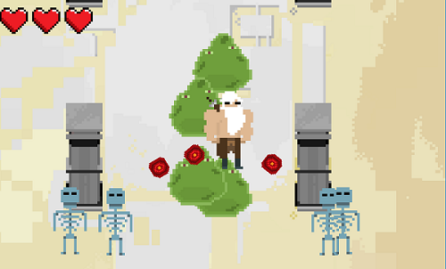

# About Me

I am a Software Engineering Senior at the **University of Texas at Dallas**, and an amateur game designer/software developer.
I also enjoy making music, gaming with friends, and taking my girlfriend out on cute dates. 


# Projects
<br><br>
### Eternal Descent
<br><br>
A 2D Hack-n-Slash made in Gamemaker2 with a few friends for a game jam. <br>
We like to refer to ourselves as *The Wranglers*. <br>
You can download a copy of the game [here](Eternal-Descent.zip)<br><br>

```markdown
while not employed:
    project = createNewProject(hoursAvailable)
    employed = showEmployerProject(project)
    if not employed:
        print("*cry noises*")
```

For my projects see [My Github](https://github.com/DrewCCannedy/).

# Contact

Shoot me an email at <a href="mailto:drew.cannedy@utdallas.edu">drew.cannedy@utdallas.edu</a> if you have a project you'd like to collaborate on.

Follow me on <a href="https://twitter.com/DrewCCannedy">Twitter</a> and <a href="https://www.instagram.com/drewccannedy/">Instagram.

Happy Hacking, **Drew**
